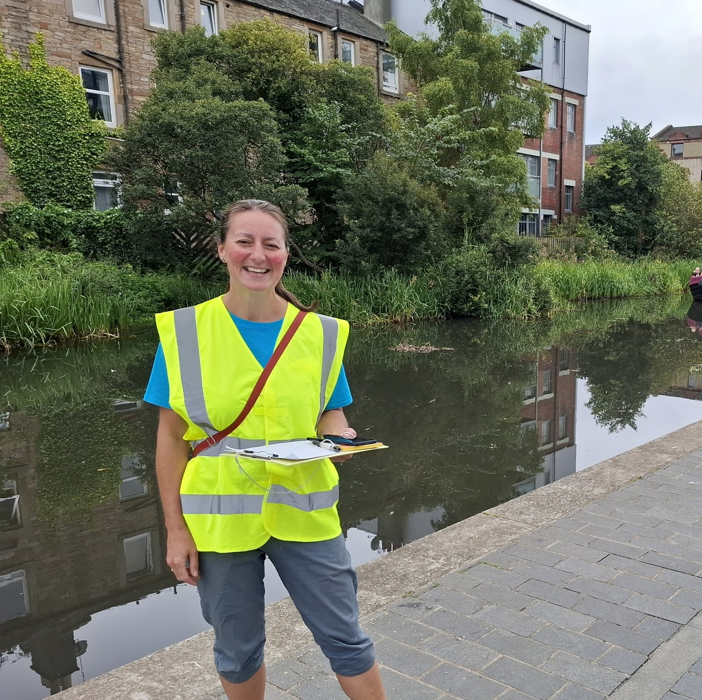
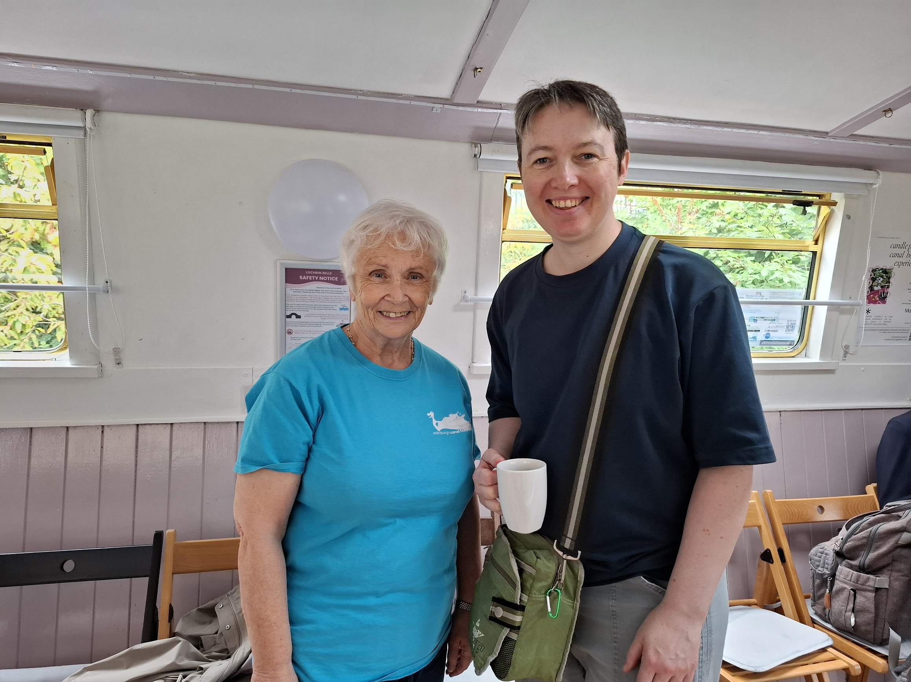
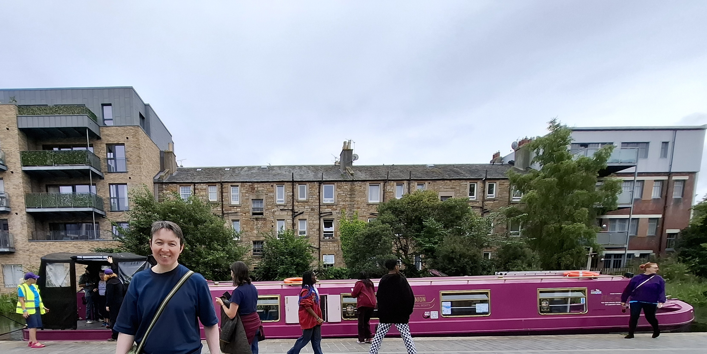
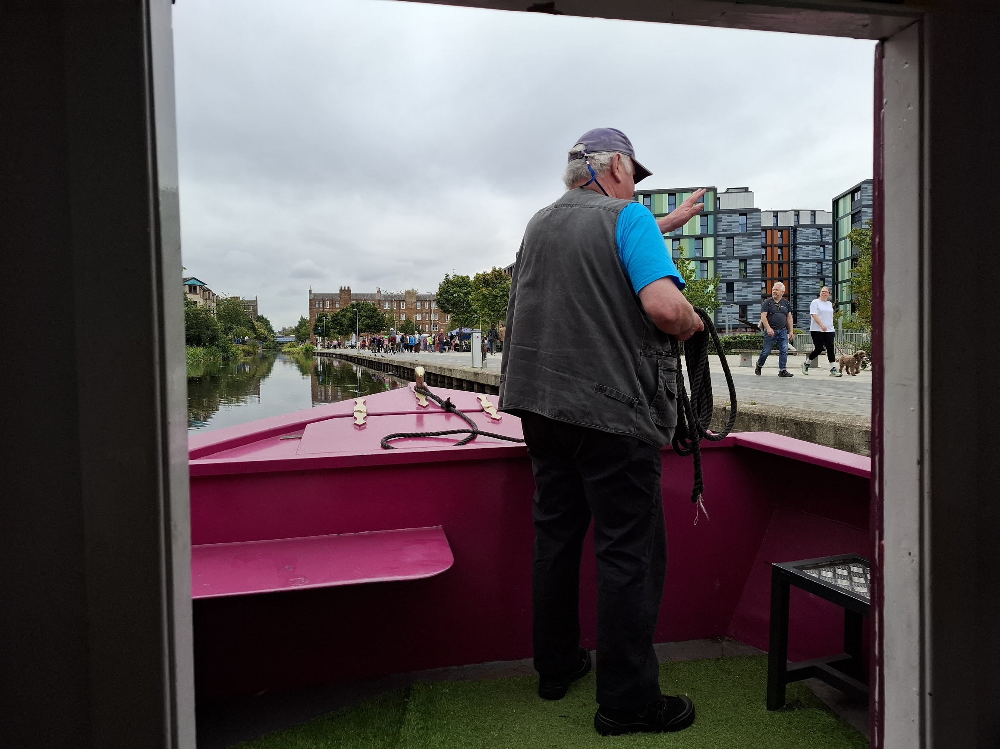

# A boat, a springboard and a footprint

It's a wonderful feeling when you can deliver for someone who has asked for practical help.

Last year Rachel Sedman from Fountainbridge Canalside Community Trust (FCCT) contacted us. Rachel wanted to know how much carbon FCCT could save by replacing their boat with an electric one. And the trust was hoping to be able to use this figure to persuade funders to help them get the money together to be able to place the order for a new, electric boat. The current barge, the Lochrin Belle, needs replacing anyway, so I needed to make a direct comparison based on the running of the boat.

The gauntlet had been well and truly thrown down. I did not have the skills myself, so I undertook the Climate Springboard course. The Climate Springboard training was truly excellent, very informative and enjoyable. I've written about that in an earlier blogpost - see \<2025-08-25-The-Climate-Springboard-trained-me-to-calculate-carbon-footprints\> I was fortunate to get a place on the course just at the right time for my project with FCCT.

I gathered the data. The annual mileage covered by the boat. The average speed. The sources of energy. The carbon emissions associated with each unit of energy. I corroborated the numbers. I produced an estimate. The Climate Springboard team gave me feedback.

I'm still working with FCCT, helping them on their carbon journey.

I was delighted to take a trip on the barge, the Lochrin Belle, in August. It was very sweet every time we went under a bridge the children called out "Echo! Echo! Echo!". I really enjoyed meeting more of the wonderful FCCT volunteers. Christine provides superb coffee and conversation aboard the barge.

## Afore ye go...

If you're part of a climate or biodiversity voluntary group or charity in Edinburgh, and you'd like us to provide some data support, please email me on [data4climateactionedinburgh\@gmail.com](mailto:data4climateactionedinburgh@gmail.com){.email} . We'd love to hear from you.

If you'd like to join the D4CAE mailing list, and/or volunteer to help, please drop me an email on [data4climateactionedinburgh\@gmail.com](mailto:data4climateactionedinburgh@gmail.com){.email} you'll be most welcome.

Pauline Ward\
Founder, Data 4 Climate Action Edinburgh

